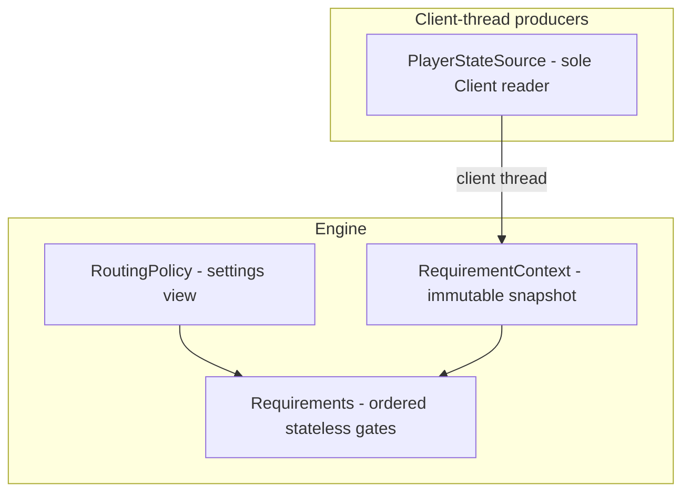

# Target architecture

Where the plugin is headed: a service graph of injected singletons reading
immutable per-refresh snapshots, with the plugin shell thinned to lifecycle
ordering and event forwarding. The current-state inventory lives in
[architecture-survey.md](architecture-survey.md); the order of moves in
[extraction-sequence.md](extraction-sequence.md).

## Layering rules

Skeleton — the full rule set lands here as boundary records fill in.

- Services constructor-inject each other's narrow read interfaces; pulling an
  immutable snapshot is the published-facts mechanism — facts are values,
  not events.
- Change notification flows inward only: producers declare "what changed" to
  the refresh coordinator as method calls; the coordinator is the sole caller
  of the path scheduler. No service reaches sideways to trigger a sibling's
  recompute.
- The shell thins to lifecycle ordering, one-line `@Subscribe` forwarders,
  and overlay/key-listener registration.
- Plugin-lifetime services are `@Singleton`/`@Inject` (Guice fails fast on
  cycles, which self-enforces the DAG); per-refresh objects are `new`;
  harness-subclassed types stay `new`-able.
- Every service and fact carries its producer-thread/consumer-thread pair;
  `PlayerStateSource` remains the only `Client` reader.

## Dependency rule

Leaf packages (`transport/`, `pathfinder/`, `requirement/`, `leagues/`,
`overlay/`) must not reference the plugin shell class; cross-cutting config
and world-geometry access goes through owned services, and all new coupling
arrives via injected seams. Today's exceptions are enumerated as a frozen
allowlist enforced by a source-scan lint — entries are removed by extraction
work, never added.

## Design resolutions

Skeleton — the open design questions (rejection-verdict consumption, the
bank-visit `boolean` seam type, subpackage-to-shell static coupling) get
their recorded resolutions here as the survey's audit findings land.

## Diagram

Target state — seeded with the landed middleware nodes; the remaining
services and lanes fill in as boundary records land.

