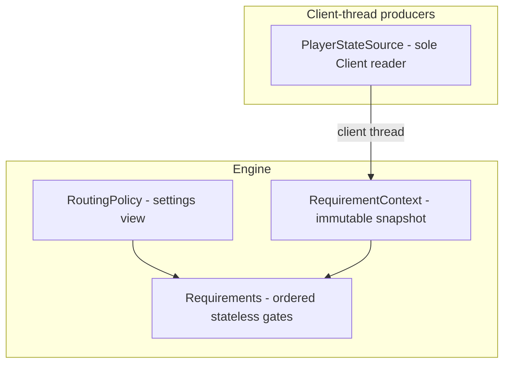

# Target architecture

Where the plugin is headed: a service graph of injected singletons reading
immutable per-refresh snapshots, with the plugin shell thinned to lifecycle
ordering and event forwarding. The current-state inventory lives in
[architecture-survey.md](architecture-survey.md); the order of moves in
[extraction-sequence.md](extraction-sequence.md).

## Layering rules

The target shape is a pragmatic Guice service graph, not a strict layer
cake. Every extraction copies the same rules:

- Services constructor-inject each other's narrow read interfaces. Pulling
  an immutable snapshot is the published-facts mechanism — the
  `RequirementContext` precedent: facts are values, not events.
- Change notification flows inward only. Producers declare "what changed"
  to the refresh coordinator as method calls; the coordinator is the sole
  caller of the path scheduler. No service reaches sideways to trigger a
  sibling's recompute.
- The plugin shell thins to lifecycle ordering, one-line `@Subscribe`
  event forwarders, and overlay/key-listener registration. Menu verbs and
  plugin-message handling delegate to their own services.
- Construction: `@Singleton`/`@Inject` for every plugin-lifetime service —
  Guice fails fast on constructor cycles, which makes the dependency graph
  self-enforcing. `new` for per-refresh objects (`Requirements`,
  `RequirementContext`) and for anything the harnesses subclass —
  `PathfinderConfig` must stay `new`-able for `TestPathfinderConfig` and
  `DashboardPathfinderConfig`. The `SpiritTreePatchState` package-private
  test constructor is the precedent for test-only construction seams.
- Every service and published fact carries its producer-thread and
  consumer-thread pair (client / worker / render) — annotated on the
  diagram below. `PlayerStateSource` stays the only `Client` reader and
  fails loudly off the client thread.

### Rejected alternatives

- **Strict layered decomposition** — every call would route through the
  layer below, so the refresh coordinator ends up brokering all
  cross-service traffic and becomes the next god object. Constructor
  injection of narrow interfaces gives the same isolation without the
  bottleneck.
- **Self-subscribing services** — each service registering directly on the
  RuneLite event bus reintroduces implicit tick ordering; today's handler
  sequence (snapshot capture before invalidation, scheduler calls last) is
  deliberate and would become unreviewable if it were smeared across
  subscriber registration order.
- **Internal domain-event bus** — an invented publish/subscribe layer adds
  infrastructure nothing else needs and confuses the thread story (which
  thread publishes, which consumes). The client already has an event bus;
  services consuming it through a second bus gain nothing.

## Dependency rule

Declared rule, in the same register the exact backend's `package-info`
already uses:

> Leaf packages — `transport/`, `pathfinder/`, `requirement/`, `leagues/`,
> `overlay/` — must not depend on `ShortestPathPlugin`. Cross-cutting
> configuration and world-geometry access goes through owned services (the
> settings service, the POH service) or leaf utilities. All new coupling
> arrives through an injected seam.

The rule covers the leaf packages only. Top-level files sit outside it:
`Destination`'s two `ShortestPathPlugin.class.getResourceAsStream` anchors
and the `CONFIG_GROUP` reads on `ShortestPathConfig`,
`PortalNexusKeybinds` and `SpiritTreePatchState` are recorded in the
survey's coupling notes and owned by the loader and settings extractions.

Today's violations are frozen in an allowlist — every leaf-package
`ShortestPathPlugin.` reference site with the migration that owns its
removal. Extraction work removes entries; entries are never added:

| Site | What it is | Owning migration |
|------|------------|------------------|
| `transport/TransportLoader.java:33` | `ShortestPathPlugin.class` resource anchor — transport TSV read | TSV data loading — the loader anchors on its own class |
| `pathfinder/SplitFlagMap.java:92` | `ShortestPathPlugin.class` resource anchor — collision-map read | TSV data loading — the loader anchors on its own class |
| `leagues/LeagueRegionChecker.java:105` | `ShortestPathPlugin.class` resource anchor — league-region read | TSV data loading — the loader anchors on its own class |
| `pathfinder/PathfinderConfig.java:31` | `import static` of `POH_LANDING_X` | POH service |
| `pathfinder/PathfinderConfig.java:32` | `import static` of `POH_LANDING_Y` | POH service |
| `pathfinder/TransportAvailability.java:9` | `import static` of `POH_LANDING_X` | POH service |
| `pathfinder/TransportAvailability.java:10` | `import static` of `POH_LANDING_Y` | POH service |
| `transport/TransportTypeConfig.java:66` | `override()` read of `useTeleportationItems` | Settings service |
| `transport/TransportTypeConfig.java:109` | `override()` read of a per-type config value | Settings service |
| `transport/TransportTypeConfig.java:125` | `override()` read of a per-type config value | Settings service |
| `pathfinder/PathfinderConfig.java:324` | `override()` read of `unreachableTargetDistanceThreshold` | Settings service |
| `pathfinder/PathfinderConfig.java:327` | `override()` read of `exactHeuristicWeight` | Settings service |
| `pathfinder/PathfinderConfig.java:328` | `override()` read of `avoidWilderness` | Settings service |
| `pathfinder/PathfinderConfig.java:329` | `override()` read of `usePoh` | Settings service |
| `pathfinder/PathfinderConfig.java:335` | `override()` read of `usePohFairyRing` | Settings service |
| `pathfinder/PathfinderConfig.java:336` | `override()` read of `usePohSpiritTree` | Settings service |
| `pathfinder/PathfinderConfig.java:337` | `override()` read of `usePohObelisk` | Settings service |
| `pathfinder/PathfinderConfig.java:341` | `override()` read of `pohJewelleryBoxTier` | Settings service |
| `pathfinder/PathfinderConfig.java:344` | `override()` read of `currencyThreshold` | Settings service |
| `pathfinder/PathfinderConfig.java:349` | `override()` read of `includeBankPath` | Settings service |
| `pathfinder/PathfinderConfig.java:352` | `override()` read of `respawnPrifddinas` | Settings service |
| `pathfinder/PathfinderConfig.java:356` | `override()` read of `unlockCanoeAxe` | Settings service |
| `pathfinder/PathfinderConfig.java:360` | `override()` read of `unlockXericsHonour` | Settings service |
| `pathfinder/PathfinderConfig.java:364` | `override()` read of `unlockDragontoothPassage` | Settings service |
| `pathfinder/PathfinderConfig.java:371` | `override()` read of `costConsumableTeleportationItems` | Settings service |
| `pathfinder/PathfinderConfig.java:372` | `override()` read of `costBankVisit` | Settings service |
| `pathfinder/PathfinderConfig.java:660` | `isInsidePoh` redirect filter | POH service |
| `pathfinder/TransportAvailability.java:100` | `isInsidePoh` origin check | POH service |
| `requirement/Requirements.java:194` | `isInsidePoh` calls inside the `pohDisabled` gate (two on one line) | POH service |
| `requirement/Requirements.java:262` | `isInsidePoh` calls inside the `pohVariant` gate (two on one line) | POH service |
| `overlay/PathTileOverlay.java:251` | `isInsidePoh` marker filter | POH service |
| `overlay/PathTileOverlay.java:286` | `isInsidePoh` tracer filter | POH service |
| `overlay/PathTileOverlay.java:321` | `isInsidePoh` marker filter | POH service |
| `overlay/PathTileOverlay.java:365` | `isInsidePoh` marker filter | POH service |
| `overlay/PathTileOverlay.java:763` | `isInsidePoh` transport-tile check | POH service |
| `overlay/PathTileOverlay.java:764` | `isInsidePoh` player-tile check | POH service |

The exemplar is honest on the same terms: `Requirements`' four
`isInsidePoh` calls sit on the two allowlisted lines above and migrate
with the POH extraction like every other site.

Enforcement is `PluginDependencyRuleTest`, a source-scan lint over the
submodule sources: the observed set must equal the allowlist exactly, so a
new reference fails the build and a stale entry fails it too — the entry
is removed in the same change that removed the reference. Run it with
`./gradlew test --tests '*DependencyRule*'` — the milestone's phase gate
and a checklist item on every extraction pull request. The wrapper `test`
task runs in neither CI nor the maintenance-verify chain today; wiring it
in is a separate scope decision.

## Design resolutions

### The gate-verdict contract stays test-only

`Requirements.check(...)` stays package-private and the `RejectionReason`
enum — nineteen constants — remains internal review instrumentation. Any
consumer outside tests is an API widening: a real change dressed as a
refactor, which would break the zero-delta attestation every extraction
relies on. The cheapest legitimate future consumer is per-gate rejection
tallies in the debug overlay panel — its own post-milestone pull request,
not bundled into the refactor. Rendering "why can't I use this" tooltips
off the verdicts is rejected outright: the tooltip overlay walks only the
computed path, which contains all-passed transports — the rejected ones
are exactly what it never sees, so the feature needs rejected-transport
rendering and hit-testing first. Exposing verdicts over the plugin-message
API is parked inside the protocol-design work rather than decided here.

### `BankVisitState` replaces the positional `boolean` at seams

The banked/unbanked `boolean` that crosses package boundaries becomes an
enum at API surfaces — `BankVisitState.CARRIED` and
`BankVisitState.BANKED` — at the availability views
(`getTransportsPacked`, `getUsableTeleports`, `getTransportAvailability`),
`TransportEligibility.usable`, `PathStep.isBankVisited`, the visited-store
and node-store signatures, and the search-loop reads. Internals stay
primitive: `state & 1`, the `FLAG_BANK_VISITED` byte and the twin visited
arrays are storage encoding, not readability problems. There is no
generalized flags container — league, free-to-play and sailing status are
per-refresh account facts (snapshot inputs), not mid-search state
transitions; the bank-visit edge is the only confirmed second dimension.
The change lands as a standalone mechanical pull request placed before the
API/presentation and scheduler work — it crosses the engine, the
middleware, the shell and the harness twins, so it cannot nest inside a
single subsystem extraction without re-diffing the same signatures twice.

### Coupling direction is declared and ratcheted

Resolved by the dependency rule above: the rule is declared, today's
violations are frozen in the allowlist, and the lint keeps the set
non-growing. Migration ownership rides the extractions named in the table —
the `override()` reads fold into the settings service, the
`isInsidePoh`/`POH_*` references into the POH service, and the resource
anchors disappear when the loader lands self-anchored.

## Diagram

Target state — seeded with the landed middleware nodes; the remaining
services and lanes fill in as boundary records land.

